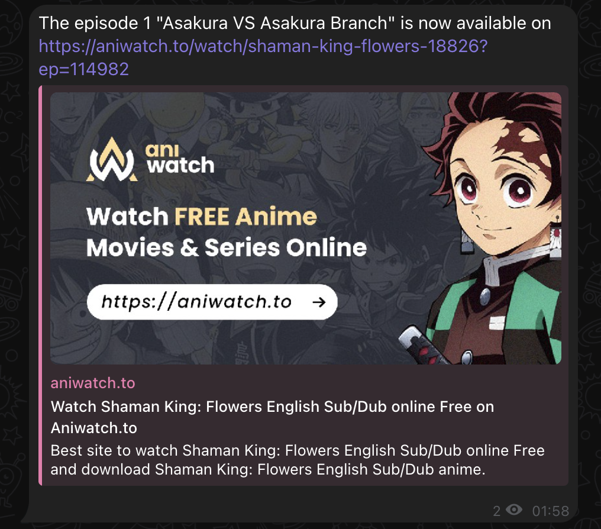

# Shaman King Episode Bot

This Telegram bot polls a website for new [Shaman King Flowers](https://en.wikipedia.org/wiki/Shaman_King:_Flowers) episodes. 

Every time a new episode is available, it sends a message with the information regarding the episode and its url.



## Disclaimer

> This bot only polls the website, I don't have any responsibility regarding the website or the upload of the episodes.

## Installation
 To run the bot, you need:
 
 ### Step 1 - Create the bot and retrieve the token
 - Create a Telegram bot as explained in the official [documentation](https://core.telegram.org/bots#6-botfather).
 
 
 - Save the token provided by the @BotFather
 
 ### Step 2 - Get chat ID
- Add bot to the Channel
- Get the list of updates for your BOT

```sh
https://api.telegram.org/bot<YourBOTToken>/getUpdates
```

- Get the chatId value from the response
> {"update_id":8393,"message":{"message_id":3,"from":{"id":7474,"first_name":"AAA"},"chat":{"id":<__CHAT_ID__>,"title":""},"date":25497,"new_chat_participant":{"id":71,"first_name":"NAME","username":"YOUR_BOT_NAME"}}}
 
 
### Step 3 - Create the .env file
On the root of the project, create a .env with

```
BOT_TOKEN=<YOUR TOKEN>
CHAT_ID=<YOUR CHAT ID>
POSTGRES_PASSWORD=root
POSTGRES_USER=root
POSTGRES_DB=shaman_king
POSTGRES_HOST=localhost
CRON_PATTERN=0 */6 * * *
```

## Migrations
### Create migration based on an entity

Create a new entity on src/infrastructure/entity

` yarn migrate:generate --migration=MIGRATION_NAME`


### Create an empty migration

Create a new entity on src/infrastructure/entity

` yarn migrate:create --migration=MIGRATION_NAME`

## Build
The transpiled files are created inside the dist folder. This name is defined on tsconfig.json file and to rename it you need to change the compilerOptions.outDir property.

#### Build code
> ```npm run build``` or ``yarn build``

## Run the bot locally with docker DB

 Comment the service `shaman-king-bot` so that only the `postgres` and `pgadmin` are uncommented

> `mkdir data`  <-- The folder where the database volume will be mounted

> `docker-compose build && docker-compose up -d` or `make start`

> ```npm run dev``` or ``yarn dev``

## Run the bot and DB with docker
> `mkdir data`  <-- The folder where the database volume will be mounted

> `docker-compose build && docker-compose up -d` or `make start`

## Makefile

This repo has a [Makefile](Makefile) with some useful commands to avoid running long docker commands

## Docker

The bot was built using Docker so it doesn't depend on external services. It includes a PostgreSQL database and the PgAdmin dashboard so you can manage your data
In order to do it:
- Access `localhost:5050` and insert the credentials specified on the `docker-compose.yml`

- On the servers, add a new one with the desired name, for the host use `host.docker.internal` and put the credentials like on the .env file


## Notes
### Install docker-compose on an unix system so that it supports docker-compose version: "3.9"

For the docker-compose to be able to run, follow these steps https://stackoverflow.com/a/74119920/9661304

## License 

[MIT](https://github.com/PedroS11/aws-s3-tools/blob/main/LICENSE.md) 
